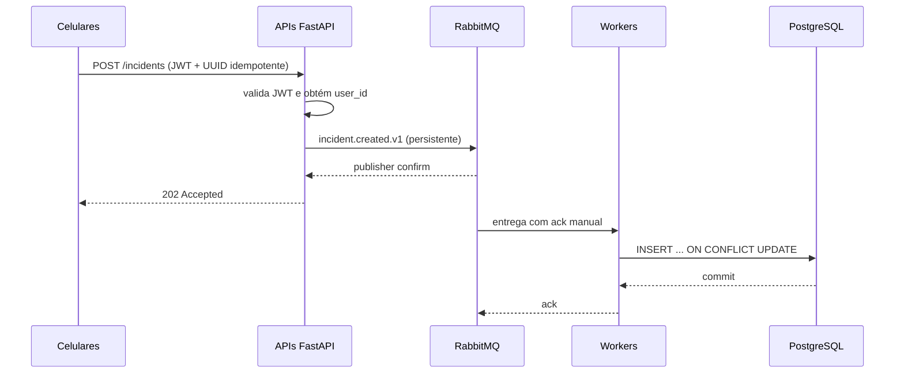

# UrbanEye — Backend orientado a eventos

## Fluxo de escrita

## Topologia RabbitMQ

| Elemento | Nome | Responsabilidade |
|---|---|---|
| Exchange topic | `urbaneye.events` | Recebe eventos de domínio versionados |
| Fila quorum | `incidents.create` | Distribui ocorrências entre workers concorrentes |
| Exchange direct | `urbaneye.retry` | Encaminha falhas transitórias |
| Fila quorum | `incidents.create.retry` | Aguarda 5 segundos antes da reentrega |
| Exchange direct | `urbaneye.dead` | Recebe eventos irrecuperáveis |
| Fila quorum | `incidents.create.dead` | Guarda poison messages para análise |

## Garantias e concorrência

- Entrega `at-least-once`: uma mensagem pode reaparecer após falhas.
- Idempotência: o UUID enviado pelo celular é a chave primária no PostgreSQL.
- Autoria confiável: `reported_by` vem do `sub` do JWT validado, nunca do corpo.
- Backpressure: cada worker busca no máximo `WORKER_PREFETCH` eventos sem ack.
- Escala horizontal: várias APIs publicam e vários workers competem pela fila.
- Compatibilidade: leituras permanecem REST síncronas; somente comandos de
  escrita que disparam processamento usam eventos.
- Evolução: o routing key inclui versão (`incident.created.v1`) para permitir
  novos contratos sem quebrar consumidores existentes.

## Implantação pública

O Compose é adequado para desenvolvimento. Produção deve separar os serviços,
executar múltiplas instâncias da API e workers, usar PostgreSQL gerenciado,
RabbitMQ com três nós, TLS, secrets, autenticação, rate limiting e métricas de
profundidade de fila, taxa de erro, idade da mensagem e tamanho da DLQ.
