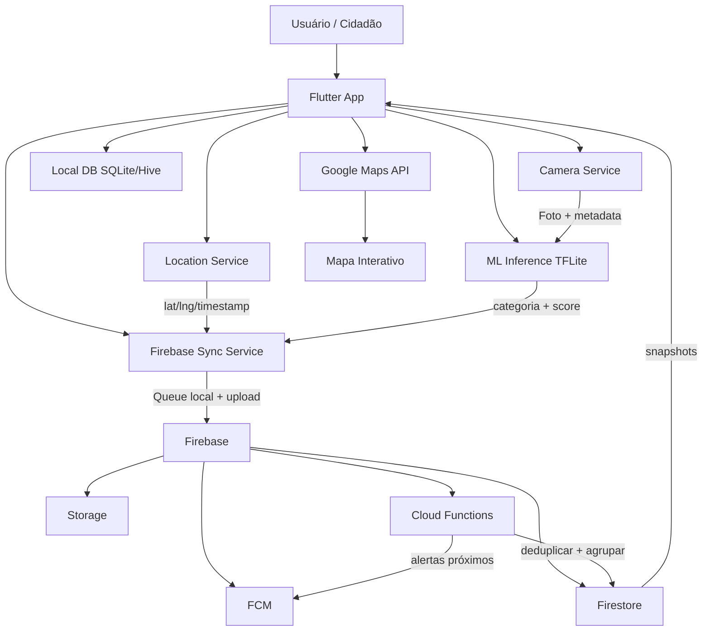
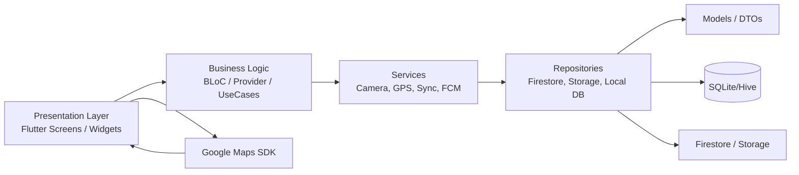
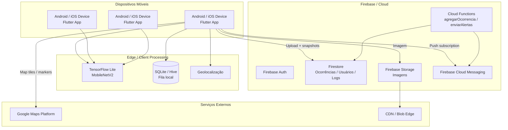
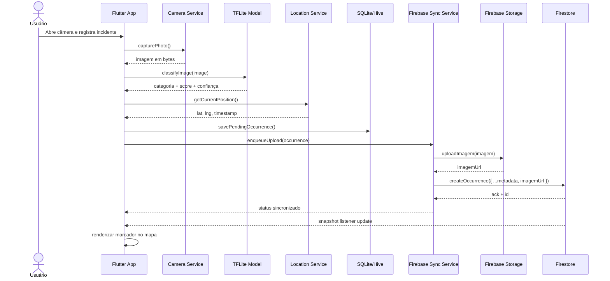
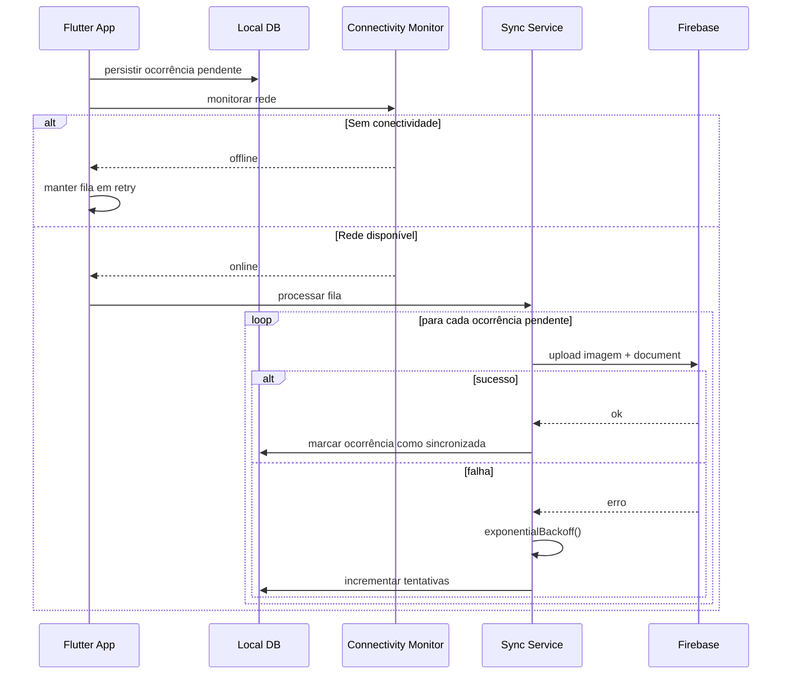
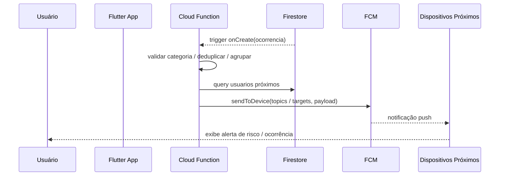
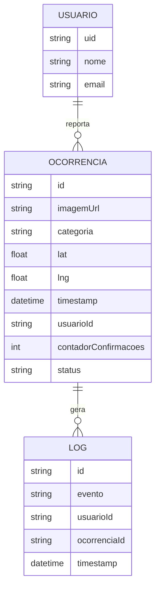
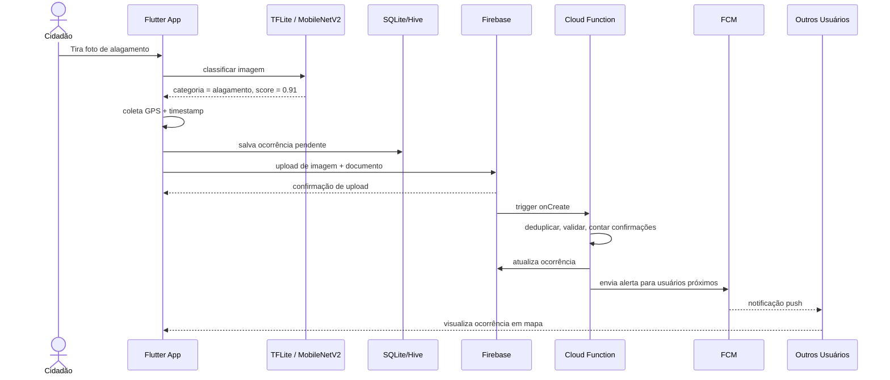

# Documento de Arquitetura de Software - UrbanEye

## Visão Geral

O UrbanEye é um sistema colaborativo de monitoramento ambiental urbano concebido para transformar imagens capturadas por cidadãos em indicadores de risco e ocorrência ambiental. O fluxo principal combina câmera do dispositivo móvel, geolocalização, análise on-device com MobileNetV2 em TensorFlow Lite, persistência local para operação offline e sincronização com Firebase para disseminação em tempo real em um mapa colaborativo.

A arquitetura adota um desenho híbrido de cliente-servidor com elementos de edge computing, processamento local e sincronização em nuvem. A inteligência de classificação ocorre no dispositivo para reduzir latência, preservar privacidade e minimizar custo de banda. A nuvem atua como orquestradora de consistência, deduplicação, notificações e visibilidade global das ocorrências.

### Diagrama de Blocos de Alto Nível



### Estilo Arquitetural Adotado

O sistema combina os seguintes princípios arquiteturais:

- Cliente-servidor: o app móvel atua como cliente ativo que envia dados para o backend e consome eventos em tempo real.
- Edge computing: inferência de classificação e validação simples ocorrem no dispositivo.
- Offline-first: quando há falha ou ausência de conectividade, o app persiste a ocorrência localmente e sincroniza quando a rede retorna.
- Event-driven / pub-sub: eventos de criação e atualização de ocorrências disparam notificações e sincronização.
- Eventual consistency: o sistema prioriza disponibilidade e tolerância a partição, especialmente em cenários de rede instável.

### Requisitos Arquiteturais

| Requisito | Estratégia arquitetural | Justificativa |
|---|---|---|
| Escalabilidade | Firestore + Cloud Functions serverless + Storage para objetos | Permite crescimento horizontal associativo sem provisionamento manual de infraestrutura |
| Disponibilidade | Persistência local + retries + replicação do estado em nuvem | O app continua funcional mesmo sem conectividade |
| Tolerância a falhas | fila local, backoff exponencial, idempotência, LWW | Reduz falhas em escrita e elimina inconsistência por reprocessamento |
| Latência | inferência local + snapshost listeners + nuvem para sincronização | A classificação fica instantânea e o mapa se atualiza sem esperas de rede |
| Segurança | Firebase Auth, regras de Firestore, token de acesso, API keys em ambiente protegido | Reduz risco de acesso indevido e vazamento de credenciais |
| Privacidade | processa imagens localmente e exige upload explícito | Garante que o usuário controle saída de mídia sensível |

### Principais Premissas de Projeto

- As ocorrências podem ser reportadas em regiões com conectividade intermitente.
- A classificação em contêiner de ML deve ser leve e executável em celulares modestos.
- A deduplicação e o processamento de urgência devem ocorrer no backend para manter qualidade dos dados.
- O consumo do mapa deve considerar volume de marcadores e limites de renderização.

---

## Arquitetura em Camadas

A arquitetura em camadas separa responsabilidades entre apresentação, lógica de negócio, dados e infraestrutura. Isso reduz acoplamento, facilita testes e permite evolução independente de cada camada.

### Camada de Apresentação

Responsável pela interação com o usuário e pelas telas principais:

- tela de login/autenticação opcional;
- captura de foto, seleção de imagem e confirmação;
- tela de mapa interativo com marcadores;
- lista de ocorrências recentes;
- painel de status da sincronização/offline.

A camada de apresentação é implementada com Flutter widgets e utilização de widgets com estado reativo (BLoC/Provider/riverpod). As interações com mapas e câmera são encapsuladas em serviços que não dependem da UI diretamente.

### Camada de Lógica de Negócio

Responsável por orquestrar fluxos e regras:

- criação de ocorrência;
- validação da foto e da categoria;
- obtenção de coordenadas e timestamp;
- submeter para sincronização;
- reconciliar fila local;
- processar eventos de snapshots e notificações.

A lógica de negócio é encapsulada em use cases ou BLoCs, tratando a aplicação como um conjunto de fluxos assíncronos e eventos estado-driven.

### Camada de Dados

Responsável por persistência local e acesso remoto:

- SQLite/Hive para filas locais;
- repositorios para `ocorrencias_pendentes` e `ocorrencias`;
- modelos do domínio;
- DAOs e adaptadores para Firestore e Storage;
- abstrações para conversão de JSON e serialização.

### Diagrama de Componentes



### Dependências e Princípios

- UI depende de lógica de negócio, não de detalhes de infraestrutura.
- Lógica depende de serviços e repositórios abstratos.
- Repositórios encapsulam I/O, permitindo mock para testes e substituição de backends.
- Os dados locais existem como fonte de verdade operacional; a nuvem é fonte compartilhada de sincronização.

---

## Visão de Implantação

A infraestrutura dispoe o cliente móvel em rede local e celular, enquanto a nuvem segue um modelo multi-região e serverless. O objetivo é reduzir latência, escalar com demanda variável e manter consistência suficiente para o uso colaborativo.

### Diagrama de Implantação



### Distribuição Geográfica e Estratégia de Edge

- Os dispositivos estão espalhados geograficamente e operam com conectividade variável.
- O processamento de classificação é feito no próprio aparelho, aproximando a computação da fonte.
- O Firebase leva o armazenamento e a orquestração centralizada em regiões configuradas.
- O uso de Storage com CDN ou distribuição de objetos reduz latência para download de imagens dos clientes.
- Em regiões com baixa conectividade, o app continua funcional através do banco local e sincronização assíncrona.

### Estratégia de Nuvem

- Firestore é o principal repositório transacional para ocorrência e metadados.
- Cloud Functions atua como camada de processamento central para deduplicação, agregação e notificação.
- FCM garante entrega eficiente de alertas por proximidade geográfica.
- O Google Maps API entrega o mapa e os overlays de marcadores em tempo real.

---

## Visão de Processos e Comunicação

### 1) Fluxo Principal: Captura → Classificação → Geolocalização → Upload → Sincronização



### 2) Fluxo de Sincronização Offline



### 3) Fluxo de Notificações Push



### Padrões de Comunicação Utilizados

| Padrão | Uso no sistema | Observações |
|---|---|---|
| REST / HTTP | upload de imagens e chamadas simples | usado principalmente para Storage e algumas integrações |
| Firestore Streams / Snapshots | atualizações em tempo real de ocorrências | ideal para UI reativa e mapa colaborativo |
| Pub/Sub / Event-driven | Cloud Functions e FCM | eventos disparam ações sem acoplamento direto |
| Mensageria assíncrona | fila local de sincronização e processamento de retry | tolera rede instável e falhas transitórias |
| WebSocket (implícito via SDK) | sincronização de dados em tempo real | o SDK do Firebase abstrai a conexão | 

---

## Modelagem de Dados

### 1) Firestore - Coleção `ocorrencias`

A coleção principal contém documentos de ocorrências urbanas. O esquema abaixo representa a estrutura mínima necessária para operação do sistema.

```json
{
  "id": "occ_123456",
  "imagemUrl": "https://storage.googleapis.com/urbaneye-bucket/images/occ_123456.jpg",
  "categoria": "alagamento",
  "lat": -23.5505,
  "lng": -46.6333,
  "timestamp": "2026-08-21T15:30:00Z",
  "usuarioId": "user_abc",
  "contadorConfirmacoes": 2,
  "status": "pendente_aprovacao",
  "metadata": {
    "confianca": 0.89,
    "origem": "mobile",
    "versaoModelo": "mobilenetv2-224-int8"
  }
}
```

Campo por campo:

| Campo | Tipo | Descrição |
|---|---|---|
| id | string | identificador único da ocorrência |
| imagemUrl | string | URL pública/assinada da imagem no Storage |
| categoria | string | tipo da ocorrência detectada ou validada |
| lat | number | latitude em graus decimais |
| lng | number | longitude em graus decimais |
| timestamp | timestamp | data/hora em UTC |
| usuarioId | string | identificador do usuário ou cliente que reportou |
| contadorConfirmacoes | number | contagem de confirmações de outros usuários |
| status | string | estado: pendente, validado, rejeitado, duplicado |

### 2) Firestore - Coleção `usuarios` (opcional)

```json
{
  "uid": "user_abc",
  "nome": "João da Silva",
  "email": "joao@email.com",
  "preferencias": {
    "raioNotificacaoKm": 3,
    "categorias": ["alagamento", "transito", "poluicao"]
  },
  "ultimaLocalizacao": {
    "lat": -23.5505,
    "lng": -46.6333,
    "timestamp": "2026-08-21T15:30:00Z"
  }
}
```

### 3) Firestore - Coleção `logs`

```json
{
  "id": "log_456",
  "evento": "ocorrencia_criada",
  "usuarioId": "user_abc",
  "ocorrenciaId": "occ_123456",
  "timestamp": "2026-08-21T15:30:05Z",
  "tipo": "audit",
  "detalhes": {
    "categoria": "alagamento",
    "statusAnterior": "pendente",
    "statusNovo": "validado"
  }
}
```

### 4) Banco Local (SQLite/Hive)

Estrutura da tabela/box `ocorrencias_pendentes`:

```sql
CREATE TABLE ocorrencias_pendentes (
  idLocal TEXT PRIMARY KEY,
  imagemPath TEXT NOT NULL,
  categoria TEXT,
  lat REAL,
  lng REAL,
  timestamp INTEGER,
  status TEXT DEFAULT 'pendente',
  tentativas INTEGER DEFAULT 0,
  ultimoErro TEXT,
  criadoEm INTEGER,
  atualizadoEm INTEGER
);
```

### 5) MER Simplificado



---

## Detalhamento dos Módulos/Componentes

### Module 1: Camera Service

Objetivo: capturar, preparar e validar imagens antes da classificação.

Responsabilidades:

- abrir câmera ou selecionar imagem da galeria;
- aplicar correções de orientação;
- redimensionar para 224x224 para o modelo MobileNetV2;
- converter para tensor no formato exigido pelo TFLite;
- compactar imagens em qualidade razoável para upload.

Exemplo de fluxo de preparação:

```dart
Future<Uint8List> prepareImageForInference(XFile file) async {
  final image = await decodeImageFromList(await file.readAsBytes());
  final resized = await resizeImage(image, width: 224, height: 224);
  final bytes = await encodePng(resized);
  return bytes;
}
```

Observações:

- Redimensionar o modelo para 224x224 equivale ao padrão usado por MobileNetV2 em aplicações de classificação genérica.
- A compactação reduz payload, mas deve preservar análise visual suficiente para o modelo.

### Module 2: Classifier Service (TFLite)

Objetivo: executar a inferência no dispositivo via TensorFlow Lite.

Fluxo técnico:

1. Carregar modelo `.tflite` em memória.
2. Pré-processar imagem para tensor normalizado.
3. Executar inferência.
4. Aplicar softmax e classificar.
5. Gerar categoria e score de confiança.

Pseudo-processamento:

```python
# Exemplo conceitual em Python
x = input_tensor / 255.0
x = (x - mean) / std
logits = interpreter(x)
probs = softmax(logits)
label = argmax(probs)
conf = probs[label]
```

Regra de decisão:

- somente aceita classificação quando `score >= threshold`;
- caso a confiança seja baixa, a ocorrência pode ser marcada como `manual_review`;
- em casos de classes ambíguas, pode haver agregação de confirmação por outros usuários.

### Module 3: Location Service

Objetivo: coletar posição do usuário de forma confiável e segura.

Responsabilidades:

- pedir permissão de geolocalização;
- usar `geolocator` para obter coordenadas precisas;
- utilizar fallback para rede quando GPS não estabiliza;
- registrar timestamp do consenso de localização;
- desabilitar coleta em cenários de baixa precisão ou alta energia.

Critérios de qualidade:

- quente: localização recente e precisa;
- temperatura: GPS com precisão moderada;
- fallback: redes celulares ou Wi-Fi com menos precisão.

### Module 4: Local Persistence (Offline-First)

Objetivo: manter operação mesmo sem rede e garantir sincronização posterior.

Estratégia:

- persistir ocorrência em SQLite/Hive imediatamente após classificação;
- registrar `status = pendente` e `tentativas = 0`;
- manter fila de sincronização em ordem de chegada;
- implementar `retry` com backoff exponencial;
- garantir idempotência da escrita ao reprocessar a mesma ocorrência.

Exemplo de política:

```text
tentativas = 0 -> retry em 5s
tentativas = 1 -> retry em 30s
tentativas = 2 -> retry em 2min
tentativas = 3 -> retry em 10min
tentativas >= 5 -> queue em estado 'deferred'
```

### Module 5: Firebase Sync Service

Objetivo: sincronizar dados locais com os serviços de nuvem.

Fluxo:

- upload da imagem para Storage;
- obter `imagemUrl`;
- criar ou atualizar documento em Firestore;
- registrar atualização local em status `sincronizado`;
- manter snapshot listeners para atualização visual do mapa.

Observação: os listeners de Firestore devem ser agregados em streams do app para evitar múltiplos rebuilds e reduzir custo de renderização.

### Module 6: Cloud Functions (Backend)

#### Função `agregarOcorrencia`

Responsabilidades:

- receber evento de criação de ocorrência;
- verificar duplicidade por proximidade geográfica e janela temporal;
- usar transação do Firestore para diminuir race conditions;
- atualizar `contadorConfirmacoes` ou unificar IDs;
- impedir duplicidades de abuso por usuários repetidos.

Pseudo lógica:

```javascript
exports.agregarOcorrencia = functions.firestore
  .document('ocorrencias/{id}')
  .onCreate(async (snap, context) => {
    const data = snap.data();
    const ref = db.collection('ocorrencias');

    const query = await ref
      .where('categoria', '==', data.categoria)
      .where('timestamp', '>=', new Date(Date.now() - 30*60*1000).toISOString())
      .get();

    // deduplicar por distância geográfica e categoria
    // atualizar contador e rejeitar duplicados se necessário
  });
```

#### Função `enviarAlertas`

Responsabilidades:

- detectar nova ocorrência com categoria relevante;
- consultar usuários próximos a partir de geolocalização e raio configurado;
- disparar FCM para grupos ou tokens específicos;
- evitar spam por limitador de taxa e filtros por categoria.

### Module 7: Map & Visualization

Objetivo: oferecer visualização geoespacial das ocorrências e eventos relevantes.

Funcionalidades:

- renderizar marcadores com categoria e score;
- clusterizar ocorrências em zoom baixo;
- carregar somente visíveis na viewport;
- atualizar em tempo real por snapshots do Firestore.

Estratégia de performance:

- usar `VisibleRegion` para filtrar marcadores;
- lazy loading não exibir milhares de marcadores simultaneamente;
- cache de imagens para compressão reduzida de processamento de UI.

---

## Segurança e Privacidade

### Autenticação

O sistema aceita autenticação anônima para reduzir atrito e permitir reportes rápidos, com evolução para email/senha ou login social em cenários de maior controle.

Modelo recomendado:

- `anonymous` como padrão;
- login opcional para usuários que desejam manter histórico e receber alertas personalizados;
- uso de Firebase Auth e perfis em `usuarios`.

### Regras de Segurança do Firestore

Exemplo de regras mínimas:

```javascript
rules_version = '2';
service cloud.firestore {
  match /databases/{database}/documents {
    match /ocorrencias/{docId} {
      allow read: if true;
      allow create: if request.auth != null || request.resource.data.usuarioId != null;
      allow update: if request.auth != null;
      allow delete: if false;
    }

    match /usuarios/{uid} {
      allow read: if request.auth != null && request.auth.uid == uid;
      allow write: if request.auth != null && request.auth.uid == uid;
    }
  }
}
```

### Privacidade e Sensoriamento

- a classificação da imagem ocorre totalmente no dispositivo;
- a foto só é enviada para a nuvem quando há consentimento explícito do usuário;
- metadados sensíveis como coordenadas podem ser minimizados quando não forem necessários;
- a URL da imagem deve ser acessível apenas via Storage e autorização adequada.

### Ofuscação de Dados Sensíveis

- nunca expor `apiKey` em código cliente;
- usar `FirebaseConfig`/`Google Maps` com restrições de origem;
- manter chaves de serviço apenas em secret manager ou variáveis de ambiente da Cloud Function;
- registrar logs sem dados pessoais e sem informações detalhadas de localização em texto aberto.

---

## Estratégias de Distribuição (O Coração do Documento)

### Concorrência e Deduplicação

Em ambientes com múltiplos usuários reportando a mesma ocorrência simultaneamente, ocorre um clássico problema de concorrência. O sistema usa uma estratégia composta por:

- chave local de deduplicação (`idLocal` com UUID e hash de imagem + coordenada + timestamp);
- `Cloud Function` para validar duplicidade geográfica e temporal;
- operação transacional no Firestore para garantir que uma ocorrência não seja duplicada em paralelo;
- `contadorConfirmacoes` para acumular evidências antes de classificar como evento confirmado.

A operação de escrita simultânea em Firestore é protegida por transações ou via `update` atômico em um documento aggregate. O que garante que duas ocorrências diferentes não se tornem um único evento e que contadores não sofram race condition.

### Consistência e Teorema CAP

O sistema adota um modelo de consistência eventual, priorizando disponibilidade e tolerância a partição (AP). Isso é apropriado para aplicação móvel em ambientes instáveis:

- o app gravará em SQLite/Hive mesmo offline;
- as mudanças são sincronizadas depois;
- clientes observam snapshots em atualização incremental.

O Teorema CAP indica que, em cenários de partição de rede, é impossível manter simultaneamente consistência forte, disponibilidade e tolerância a falha. Para UrbanEye, o trade-off mais relevante é:

- priorizar AP: o sistema deve funcionar mesmo com rede fragmentada;
- aceitar eventual consistency para dados geoespaciais e avisos de risco.

### Tolerância a Falhas

A estratégia offline-first é central:

1. O usuário reporta a ocorrência localmente.
2. O app grava no banco de dados local e diagnostica status de sincronização.
3. O sincronizador verifica conectividade.
4. Quando a rede volta, reenvia em fila.
5. Se a chamada falhar, aplica backoff exponencial e mantém registro de retries.

Política de resolução de conflitos:

- preferir `Last Write Wins` com base em `timestamp` do servidor;
- quando houver conflito entre duas gravações do mesmo campo, a versão mais recente (servidor) sobrescreve;
- para imagens, mantém-se a imagem da última confirmação válida quando o documento foi atualizado.

### Replicação

- Firestore replica dados em múltiplas regiões de acordo com configuração da nuvem;
- clientes leem snapshots de documentos e recebem propagação imediata do estado;
- o banco local atua como cache e mecanismo de persistência local para operação e reconciliação.

### Escalabilidade

A escalabilidade do sistema é favorecida por:

- Firestore horizontalmente escalável para leitura/escrita de documentos;
- Cloud Functions serverless permitindo auto-scaling conforme eventos;
- Storage para imagens desacoplando upload e distribuição de mídia;
- redução do volume de dados na UI com paginação e lazy loading do mapa.

Gargalos principais:

- Storage eUpload de imagens podem se tornar gargalo quando há muitos usuários com alta largura de banda;
- renderização de marcadores em mapa pode degradar com milhares de pontos visíveis em uma única viewport;
- inferência on-device pode consumir bateria e CPU em dispositivos de baixo desempenho.

---

## Diagrama Geral de Sequência (Fluxo End-to-End)



---

## Considerações de Performance e Otimização

### Modelo TFLite e Quantização

Para reduzir tamanho e consumo, recomenda-se:

- quantização `int8` ou `uint8` do modelo;
- exportação para TensorFlow Lite com menor largura de banda e uso de memória;
- uso de `InterpreterOptions` para reduzir carga e tempo de inferência;
- benchmark em dispositivos alvo para garantir tempo aceitável de resposta.

### Cache de Imagens

- `CachedNetworkImage` ou mecanismo equivalente para reduzir recargas;
- cache de miniaturas no dispositivo;
- armazenamento em disco local para que mapas e listas não sejam reprocessados a cada render.

### Gerenciamento de Estado

- evitar rebuilds desnecessários com seleção cuidadosa de blocos e stream subscriptions;
- usar `StreamBuilder`/`BlocBuilder` apenas nas telas que dependem do estado;
- unificar a fila de sincronização em um único scheduler para evitar concorrência indevida.

### Lazy Loading no Mapa

- carregar apenas marcadores visíveis na viewport atual;
- usar clustering para reduzir número de overlays;
- debouncing de eventos de pan/zoom para reduzir cálculos em alta frequência.

### KPI de Performance Recomendados

| Indicador | Meta |
|---|---|
| Tempo de inferência do modelo | < 300 ms em dispositivos medianos |
| Tempo entre captura e persistência local | < 1 s |
| Tempo de upload de imagem em rede 4G | < 10 s para imagens médias |
| Tempo de atualização do mapa após snapshot | < 2 s |
| Taxa de retry de sync com falha temporária | 95% em 3 tentativas |

---

## Glossário de Termos Arquiteturais

- AP: disponibilidade e tolerância à partição, segundo o teorema CAP.
- CP: consistência forte e tolerância à partição, sem priorizar disponibilidade.
- Pub/Sub: padrão de comunicação assíncrona em que produtores e consumidores trocam eventos por meio de tópicos.
- Edge Computing: processamento próximo da fonte de dados, reduz latência e banda.
- Eventual Consistency: consistência temporária em que os dados se convergem com o tempo.
- Quorum: conjunto mínimo de replicas que precisa responder para validar uma operação.
- Split-Brain: cenário em que múltiplos nós ativos assumem controle sem coordenação, gerando inconsistência.
- Idempotência: operação que pode ser reexecutada sem efeitos colaterais duplicados.
- Backoff Exponencial: estratégia de retry em que o intervalo cresce exponencialmente após falhas.

---

## Conclusão

A arquitetura do UrbanEye é projetada para equilíbrio entre mobilidade, privacidade, escalabilidade e tolerância a falhas. O app móvel funciona como ponta de coleta inteligente e o backend em Firebase atua como plataforma de orquestração, processamento, deduplicação e disseminação de ocorrências. O uso de machine learning on-device, sincronização offline-first e notificações por proximidade alinha a solução com requisitos reais de sistemas urbanos colaborativos em ambiente de rede variada e parcialmente instável.

Ao combinar processamento local, consistência eventual e automações em nuvem, o sistema consegue operar de forma resiliente, produzir dados valiosos para gestão ambiental urbana e manter UX adequada mesmo em cenários desafiadores de conectividade.
